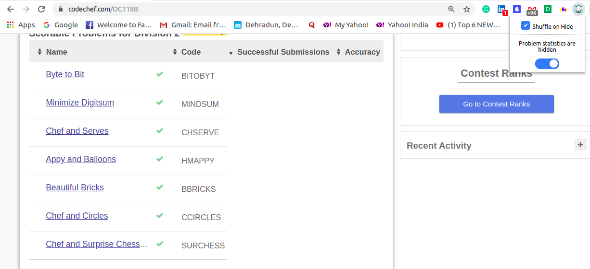

# Codechef Contest Problem Statistics Hider
Chrome Extension to hide the submissions and accuracy of problems in Codechef contests to save participants from demotivation

# Description

During the Codechef contests, the number of successful submissions and accuracy are displayed next to each problem.

If the number of successful submissions or the accuracy of the problems is very less, it becomes very demotivating for some participants and they approach the problems with a losing mentality.

Besides, such statistics do not pose any benefit in contests like the Codechef Long Challenge, which is a 10 day long monthly coding marathon.

To overcome this problem, I have built a chrome extension to hide these stats of all the problems. It will help people to freely attempt all the problems without worrying about the outcomes even before they attempt.

Also it has an option for shuffling the problems when hiding, which further prevents from identifying the dificulty of problems beforehand.

# Installation

1. After cloning the project, open the chrome browser and go to [chrome://extensions](chrome://extensions)
2. Turn on the Developer Mode
3. Click on Load Unpacked and select the folder where the project is cloned.
4. You will see the chrome extension in the browser toolbar.

# Usage

* Since the extension is a page action extension, it will only work on [codechef.com](https://www.codechef.com)
* You can enable and disable hiding the problem stats using the toggle button in the extension popup.
* You can choose to enable shuffling of problems. Problems are shuffled when their stats are being hidden.
* The state of the toggle buttons are saved, hence you do not need to enable them again and again when you restart your browser.
* Go to any contest page of codechef.com. If the hide toggle button is enabled, you will see that the problem stats of all problems are hidden.
* If the shuffle toggle button is also enabled with the hide button, the problems will be randomly rearranged.

# Screenshots

## Toggle Off

## Toggle On

## Notification

